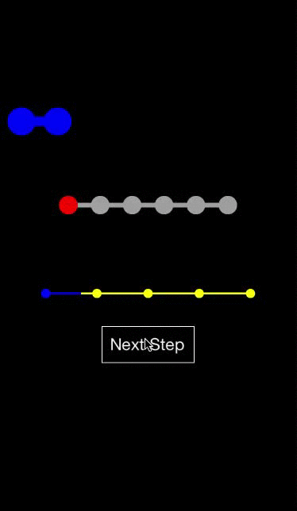

# CMSteppedProgressBar

[](https://travis-ci.org/Mycose/CMSteppedProgressBar)
[](http://cocoapods.org/pods/CMSteppedProgressBar)
[](http://cocoapods.org/pods/CMSteppedProgressBar)
[](http://cocoapods.org/pods/CMSteppedProgressBar)

## CMSteppedProgressBar
Customizable progress bar with steps

## CMSteppedProgressBar Properties:
```objc
/// set nbSteps in last because it will create all views, so if you want a custom design customize before setting the number of steps
@property (nonatomic) NSUInteger numberOfSteps;
/// set manually the currentStep or use stepNext/stepPrev
@property (nonatomic) NSUInteger currentStep;
/// change the line height between the dots, default is 5
@property (nonatomic) CGFloat linesHeight;
/// change the width of the dots, default is 20
@property (nonatomic) CGFloat dotsWidth;
/// anim duration, default is 0.6f
@property (nonatomic) NSTimeInterval animDuration;
/// anim type, default is curve ease in
@property (nonatomic) UIViewAnimationOptions animOption;
/// change the color of the bar when not filled, gray by default
@property (nonatomic, strong) UIColor* barColor;
/// change the color of the bar when it's filled, white by default
@property (nonatomic, strong) UIColor* tintColor;
```

## CMSteppedProgressBar Delegation : CMSteppedProgressBarDelegate
Called when the user click on an activated step dot, send you the sender and the step clicked
```objc
- (void)steppedBar:(CMSteppedProgressBar *)steppedBar didSelectIndex:(NSUInteger)index;
```

## CMSteppedProgressBar Usage Example:
```objc
self.steppedBar1 = [[CMSteppedProgressBar alloc] initWithFrame:CGRectMake(0, 100, self.view.frame.size.width, 60)];
    self.steppedBar1.animDuration = 0.1;
    self.steppedBar1.barColor = [UIColor clearColor];
    self.steppedBar1.tintColor = [UIColor blueColor];
    self.steppedBar1.linesHeight = 10.f;
    self.steppedBar1.dotsWidth = 30.f;
    self.steppedBar1.nbSteps = 8;
    [self.view addSubview:self.steppedBar1];
    
    self.steppedBar2 = [[CMSteppedProgressBar alloc] initWithFrame:CGRectMake(50, self.steppedBar1.frame.origin.y + 100, self.view.frame.size.width-100, 40)];
    self.steppedBar2.animDuration = 1.f;
    self.steppedBar2.barColor = [UIColor lightGrayColor];
    self.steppedBar2.tintColor = [UIColor redColor];
    self.steppedBar2.nbSteps = 6;
    self.steppedBar2.animOption = UIViewAnimationOptionCurveEaseIn;
    [self.view addSubview:self.steppedBar2];
    
    self.steppedBar3 = [[CMSteppedProgressBar alloc] initWithFrame:CGRectMake(0, self.steppedBar2.frame.origin.y + 100, self.view.frame.size.width, 30)];
    self.steppedBar3.barColor = [UIColor yellowColor];
    self.steppedBar3.tintColor = [UIColor blueColor];
    self.steppedBar3.linesHeight = 2.f;
    self.steppedBar3.dotsWidth = 10.f;
    self.steppedBar3.nbSteps = 5;
    [self.view addSubview:self.steppedBar3];
```


## Installation
CMSteppedProgressBar is available through [CocoaPods](http://cocoapods.org). To install
it, simply add the following line to your Podfile:

```ruby
pod "CMSteppedProgressBar"
```

## Author
Mycose, morissard@gmail.com

## License
CMSteppedProgressBar is available under the MIT license. See the LICENSE file for more info.
